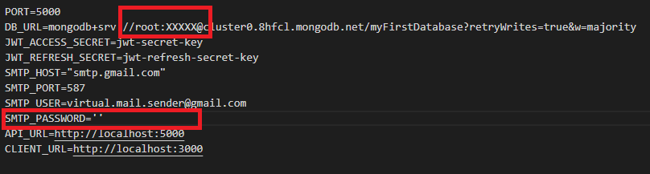

## **JWT AUTHORIZATION**

An example of the implementation authorization and registration functionality in REST API, using jwt.
 

- **Server Part**
  https://github.com/ieffai/jwt-auth-server

- **Instructions:**
  1. Need to deploy both client and server part;
  2. Install all dependencies;
  3. 'npm start' to run client and 'npm run dev' to run server;
  4. !!! in .env file you need to use your own nodemailer, or please contact me to recieve temporary key
  ## 

---

- **Used technologies**
  ### On client: React, MobX, axios.
  ### On server: express, mongoDB, nodemailer, cors, cookie-parser

---

**For suggestions and errors:**
4923920@gmail.com
